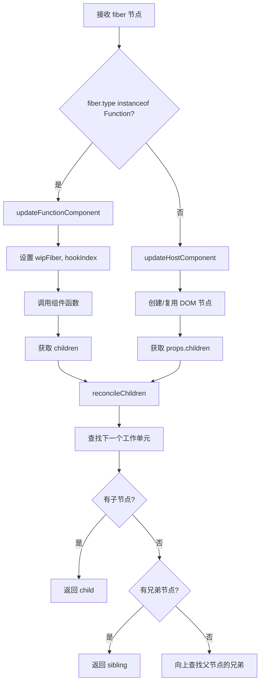

```ts
import { Didact } from '../src/index';

const { createElement, render, useState } = Didact;

function Counter() {
    const [count, setCount] = useState(0);
    return createElement(
        'div',
        null,
        createElement('h1', null, '迷你 React 计数器'),
        createElement('p', null, `当前计数: ${count}`),
        createElement(
            'button',
            { onClick: () => setCount(c => c + 1) },
            '点我 +1'
        )
    );
}

const element = createElement(Counter, null);
const container = document.getElementById('root');
render(element, container);
```

## 整体代码结构流程

`src/core.ts` 的代码逻辑可以分为五个主要模块，按照执行顺序和依赖关系组织 ：
> Mermaid Live Editor 网址: https://mermaid.live


## 核心执行流程

整个框架的执行流程从 `render` 函数开始，触发一系列连锁反应 ：


## 关键函数执行逻辑

### 1. 工作循环 (workLoop)

工作循环是整个系统的心脏，使用时间切片来避免阻塞浏览器 ：


### 2. 工作单元处理 (performUnitOfWork)

每个工作单元的处理逻辑区分函数组件和宿主组件：



### 3. 协调算法 (reconcileChildren)

协调算法是 Diff 算法的核心，比较新旧 Fiber 树 ：

```mermaid
flowchart TD
    START[开始协调] --> INIT[初始化索引和指针]
    INIT --> LOOP{index < elements.length || oldFiber != null?}
    
    LOOP -->|是| GET_ELEMENT[获取当前元素]
    GET_ELEMENT --> COMPARE{element.type === oldFiber.type?}
    
    COMPARE -->|是| UPDATE[创建 UPDATE fiber]
    COMPARE -->|否| CHECK_NEW{element 存在?}
    
    CHECK_NEW -->|是| PLACEMENT[创建 PLACEMENT fiber]
    CHECK_NEW -->|否| SKIP_NEW[跳过新建]
    
    UPDATE --> LINK[链接到父节点]
    PLACEMENT --> LINK
    
    COMPARE -->|否| CHECK_OLD{oldFiber 存在?}
    CHECK_OLD -->|是| DELETION[标记 DELETION]
    CHECK_OLD -->|否| SKIP_DEL[跳过删除]
    
    DELETION --> PUSH_DEL[添加到 deletions 数组]
    PUSH_DEL --> LINK
    SKIP_NEW --> LINK
    SKIP_DEL --> LINK
    
    LINK --> ADVANCE[推进指针]
    ADVANCE --> LOOP
    
    LOOP -->|否| END[协调完成]
```

### 4. 提交阶段 (commitRoot)

提交阶段将所有变更同步应用到真实 DOM ：


### 5. useState Hook 实现

useState 实现了状态管理和重新渲染触发机制 ：

```mermaid
flowchart TD
    USE_STATE[useState 调用] --> GET_OLD[获取旧 hook]
    GET_OLD --> CREATE_HOOK[创建新 hook]
    CREATE_HOOK --> PROCESS_QUEUE[处理 action 队列]
    PROCESS_QUEUE --> CREATE_SETTER[创建 setState 函数]
    
    CREATE_SETTER --> PUSH_HOOK[添加到 fiber.hooks]
    PUSH_HOOK --> INCREMENT[hookIndex++]
    INCREMENT --> RETURN[返回 [state, setState]]
    
    subgraph "setState 调用流程"
        SET_STATE[setState 调用] --> PUSH_ACTION[action 入队]
        PUSH_ACTION --> SCHEDULE[调度新渲染]
        SCHEDULE --> NEW_ROOT[创建新 wipRoot]
        NEW_ROOT --> SET_WORK[设置 nextUnitOfWork]
        SET_WORK --> CLEAR_DEL[清空 deletions]
    end
```

### Citations

**File:** plugins/aix-react/src/core.ts (L1-1)
```typescript
const Didact = (() => {
```

**File:** plugins/aix-react/src/core.ts (L77-80)
```typescript
    let nextUnitOfWork = null; // 下一个工作单元
    let wipRoot = null;        // 正在构建的 Fiber 树
    let currentRoot = null;    // 当前已提交的 Fiber 树
    let deletions = null;      // 待删除的 Fiber 节点
```

**File:** plugins/aix-react/src/core.ts (L83-92)
```typescript
    function render(element, container) {
        wipRoot = {
            type: 'div',
            dom: container,
            props: { children: [element] },
            alternate: currentRoot,
        };
        deletions = [];
        nextUnitOfWork = wipRoot;
    }
```

**File:** plugins/aix-react/src/core.ts (L95-107)
```typescript
    function workLoop(deadline) {
        let shouldYield = false;
        while (nextUnitOfWork && !shouldYield) {
            nextUnitOfWork = performUnitOfWork(nextUnitOfWork);
            shouldYield = deadline.timeRemaining() < 1;
        }

        if (!nextUnitOfWork && wipRoot) {
            commitRoot();
        }

        requestIdleCallback(workLoop);
    }
```

**File:** plugins/aix-react/src/core.ts (L109-109)
```typescript
    requestIdleCallback(workLoop);
```

**File:** plugins/aix-react/src/core.ts (L112-129)
```typescript
    function performUnitOfWork(fiber) {
        const isFunctionComponent =
            fiber.type instanceof Function;

        if (isFunctionComponent) {
            updateFunctionComponent(fiber);
        } else {
            updateHostComponent(fiber);
        }

        if (fiber.child) return fiber.child;
        let next = fiber;
        while (next) {
            if (next.sibling) return next.sibling;
            next = next.return;
        }
        return null;
    }
```

**File:** plugins/aix-react/src/core.ts (L154-210)
```typescript
    // 协调子节点（新旧 Fiber 比对）
    function reconcileChildren(wipFiberNode, elements) {
        let index = 0;
        let oldFiber = wipFiberNode.alternate && wipFiberNode.alternate.child;
        let prevSibling = null;

        while (index < elements.length || oldFiber != null) {
            const element = elements[index];
            let newFiber = null;

            const sameType =
                oldFiber && element && element.type === oldFiber.type;

            if (sameType) {
                // 类型相同 -> 复用 DOM，标记更新
                newFiber = {
                    type: oldFiber.type,
                    props: element.props,
                    dom: oldFiber.dom,
                    return: wipFiberNode,
                    alternate: oldFiber,
                    effectTag: 'UPDATE',
                };
            }

            if (element && !sameType) {
                // 新增节点
                newFiber = {
                    type: element.type,
                    props: element.props,
                    dom: null,
                    return: wipFiberNode,
                    alternate: null,
                    effectTag: 'PLACEMENT',
                };
            }

            if (oldFiber && !sameType) {
                // 删除旧节点
                oldFiber.effectTag = 'DELETION';
                deletions.push(oldFiber);
            }

            if (oldFiber) {
                oldFiber = oldFiber.sibling;
            }

            if (index === 0) {
                wipFiberNode.child = newFiber;
            } else if (element) {
                prevSibling.sibling = newFiber;
            }

            prevSibling = newFiber;
            index++;
        }
    }
```

**File:** plugins/aix-react/src/core.ts (L213-218)
```typescript
    function commitRoot() {
        deletions.forEach(commitWork);
        commitWork(wipRoot.child);
        currentRoot = wipRoot;
        wipRoot = null;
    }
```

**File:** plugins/aix-react/src/core.ts (L253-282)
```typescript
    function useState(initial) {
        const oldHook =
            wipFiber.alternate && wipFiber.alternate.hooks && wipFiber.alternate.hooks[hookIndex];

        const hook = {
            state: oldHook ? oldHook.state : initial,
            queue: [],
        };

        const actions = oldHook ? oldHook.queue : [];
        actions.forEach(action => {
            hook.state = typeof action === 'function' ? action(hook.state) : action;
        });

        const setState = action => {
            hook.queue.push(action);
            // 从根节点调度一次新渲染
            wipRoot = {
                dom: currentRoot.dom,
                props: currentRoot.props,
                alternate: currentRoot,
            };
            nextUnitOfWork = wipRoot;
            deletions = [];
        };

        wipFiber.hooks.push(hook);
        hookIndex++;
        return [hook.state, setState];
    }
```

**File:** plugins/aix-react/src/core.ts (L284-290)
```typescript
    // --- 对外暴露的 API ---
    return {
        createElement,
        render,
        useState,
    };
})();
```


